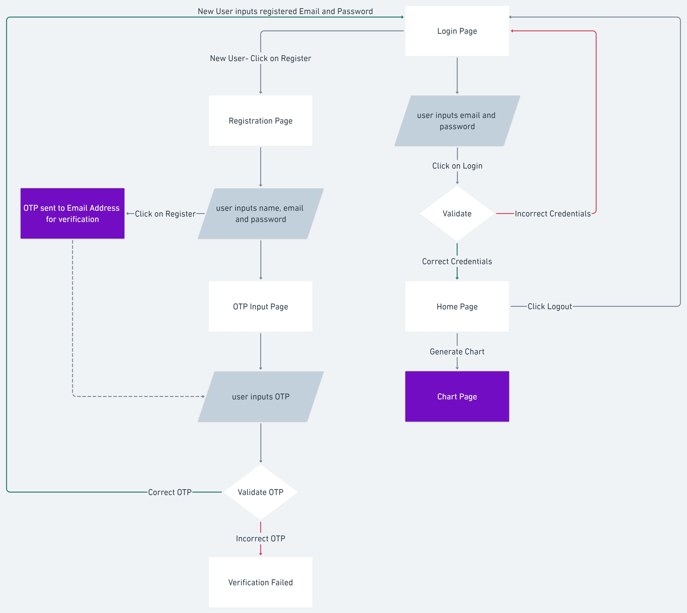
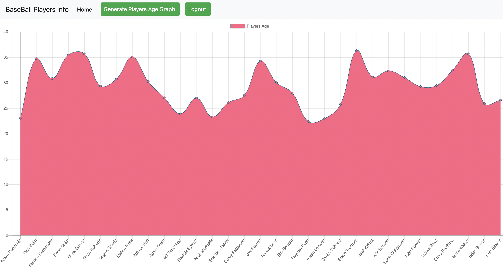
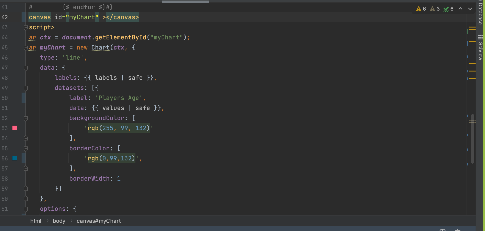
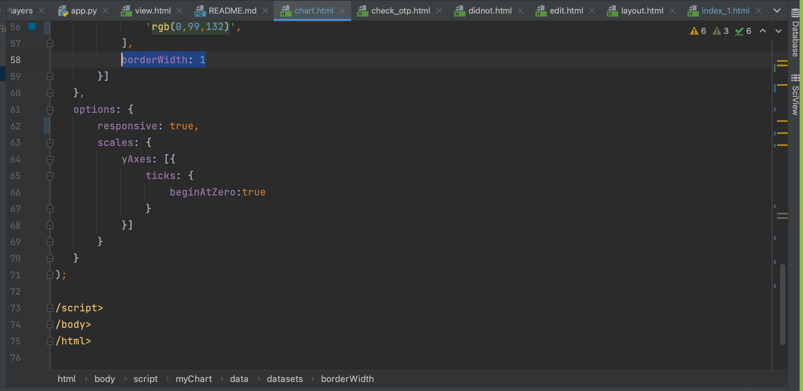
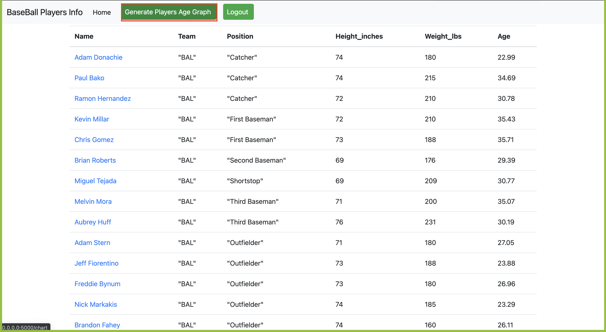

# IS601 Final Project
This project has two parts:
- Login and Email Verification using SendGrid - Sri Siva Krishna Teja Oguri (so43@njit.edu)
- Statistical Chart Generation - Harish (hn25@njit.edu)

# Logic Flow


# Login and Email Verification - Sri Siva Krishna Teja Oguri (so43@njit.edu)
## Approach
- Explored SendGrid Email Functionality.
- Started with taking Part 4 of Mini Project to maintain the file structure and skeleton.
- Implemented Basic Login Feature
    - Take Email and Password from the Login form
    - Check if those particular Email and password exist in the database
    - If exists - navigate to Home Page
    - If does not exist - navigate back to Login Page
    
- Implemented Basic Register Feature
    - Take Name,Email,Password from Register Form
    - Insert into the database
    - Tested if the login works with the new credentials
    
- Using SendGrid to Send Mail
    - Previously explored SendGrid before going forward with this project.
    - Created an API KEY from SendGrid website
    - Using the Documentation, API reference and examples - mail sending worked
    
- Email Verification
    - Part 1 - Generate OTP and send as part of the email to a new user's email address
    - Part 2 - New form to enter the OTP, validate if the OTP matches
    - Part 3 - If the OTP Matches -> Insert the New User's Information (Name,Email,Password) into the Database
    - To achieve the above functionality - explored sessions and how to create session and store information into a session
    
- Code (OTP for Email Verification)
    - Create a random number(OTP)
    ```
    def gen_otp():
    return random.randrange(1000,9999)
    ```
    - Store OTP along with user data(Name,Email,Password)  into the session and send OTP as part of the Email
    ```
    def signup_process():
    session['name'] = request.form.get('new_name')
    session['email'] = request.form.get('new_email')
    session['password'] = request.form.get('new_password')
    session['otp'] = gen_otp()
    message = Mail(
        from_email='krishnaoguri17@gmail.com',
        to_emails=request.form['new_email'],
        subject='Verification Mail',
        html_content="<strong>Here is your OTP for email verification :" + str(session['otp']) + "</strong>")
    sendgrid_client = SendGridAPIClient(api_key=os.environ.get("SENDGRID_API_KEY"))
    response = sendgrid_client.send(message)
    print(response.status_code)
    print(response.body)
    print(response.headers)
    return render_template('check_otp.html')
    ```
    - Function to check if the user given OTP matches with otp stored in the session, if OTP matches - insert the user data stored in the session(Name,Email,Password) to database
    ```
    def check_otp():
    user_otp = request.form.get('otp')
    if str(user_otp) == str(session['otp']):
        name = session['name']
        email = session['email']
        password = session['password']
        cursor = mysql.get_db().cursor()
        cursor.execute("""Insert into `user_Info` (`id`,`Name`,`Email`,`Password`) VALUES (NULL,'{}','{}','{}')"""
                           .format(name,email,password))
        mysql.get_db().commit()
        return redirect('/')
    else:
        return "Verification Failed"

    ```
    - Once registered, user is navigated to login page where user can login using the registered credentials.

# JavaScript Chart Feature - Harish(hn25@njit.edu)
# Baseball Player Age graph

This graph depicts the age of the baseball players in a line graph style using Chart.JS API.
## Approach
- Explored all the all the javascript chart options given by the professor.
- Started with Chart.JS which is extensively used with javascript programming for creating static and dynamic charts.
- Implemented the basic graph using the sample code given in the Chart.JS website
- Tried all the graph styles available in the Chart.JS library



  
- Customized the color to make it more vibrant



- Tried to make the graph responsive to fit it in all screen sizes



- The chart can be found in the navbar by clicking the Generate Players Age Graph

## How to run the app
- Software requirements: Docker, Pycharm
- run using a docker-compose configuration
- For the email verification to function the .env file has to be in the app folder


